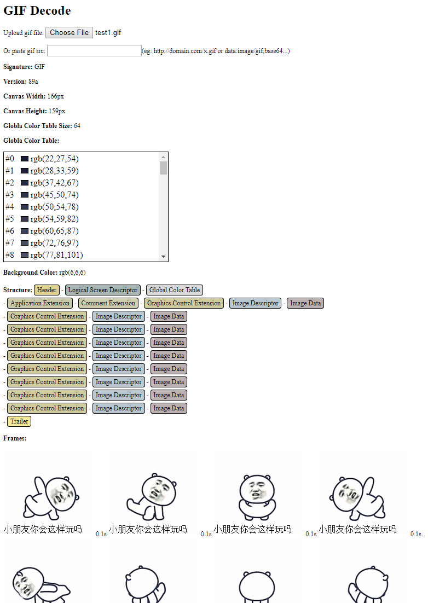

# gifdecode.js
Decoding static and animated gifs on browsers.

## Demo
http://markbuild.com/proj/js/gifdecode.js/example/gifDecode.html

A gif file

Screenshot after upload above gif file.

## References
http://www.matthewflickinger.com/lab/whatsinagif/bits_and_bytes.asp

(Chinese中文) http://markbuild.com/javascript解码gif动画二进制/
